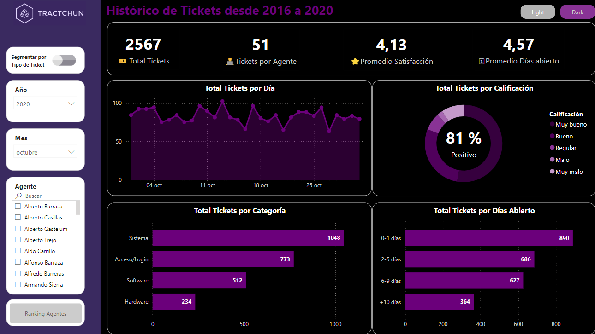

# Histórico de Tickets Tractchun

## Explicación

Histórico de Ticket de la empresa Tractchun y Ranking con el desempeño de sus agentes durante el periodo de 2016 a 2020.

La compañía Tractchun es una compañía ficticia de la industria manufacturera que cuentas con agentes IT que dan soporte a Tickets para todo lo referente a su tecnología de oficina. La empresa requiere monitorear y revisar áreas de mejora en su servicio a partir del sistema de Tickets y realizar un análisis más profundo en base a clasificaciones de sus empleados con información procedente del departamento de Recursos Humanos.

